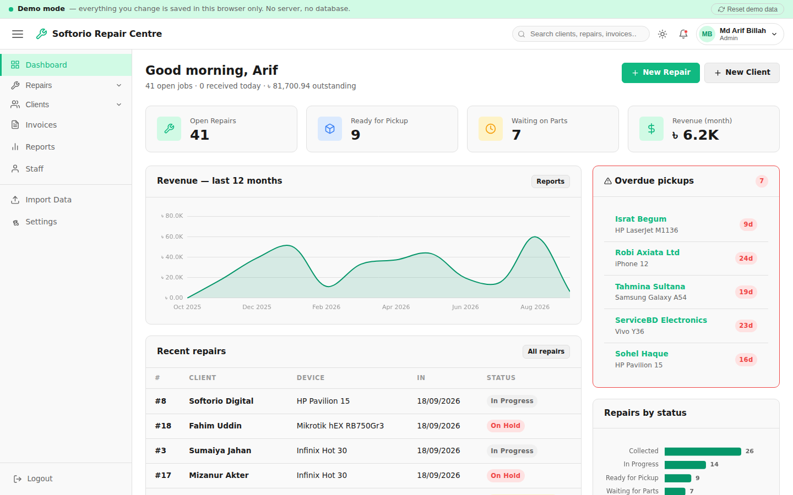

# Live Demos — Service Management System

A front-end prototype of the PHP/MySQL application in the repository root.
No server, no database: it runs entirely in the browser and is served free
from GitHub Pages.

**Live:** https://arifbillahcse.github.io/a-repair-management-database-system/

## Four demos, one codebase

| Path | Demo | Vocabulary |
|---|---|---|
| `/repair/` | Repair Shop    | Clients → Repairs · Device · Technician |
| `/dental/` | Dental Clinic  | Patients → Treatments · Procedure · Dentist |
| `/auto/`   | Auto Service   | Customers → Job cards · Vehicle · Mechanic |
| `/ac/`     | AC & Appliance | Clients → Service calls · Unit · Engineer |

Every variant loads the same `js/` tree. Each `<variant>/index.html` sets
`window.DEMO_VARIANT` before the scripts run; `js/variants.js` then supplies
the labels, the status vocabulary, the company identity and the seed file,
and `js/constants.js` consumes it.

Storage is namespaced per variant (`rms_dental_…`), so the four datasets and
sessions never collide.

Adding a fifth industry:

1. Add an entry to `VARIANTS` in `js/variants.js`
2. Add a profile to the seed generator and produce `assets/data/seed-<id>.json`
3. Copy any `<variant>/index.html` and change the one `DEMO_VARIANT` line
4. Add a card to the landing page

No application code changes.



Screenshots of every module are in the
[main README](../README.md#screenshots).

---

## What it demonstrates

| Module | What works |
|---|---|
| **Dashboard** | KPI cards, 12-month revenue chart, recent repairs, overdue-pickup alerts, technician workload, activity log |
| **Clients** | List with search / filter / sort / pagination, detail view with lifetime stats, create, edit, delete (FK-guarded), CSV export |
| **Repairs** | Full job lifecycle, status pipeline with legal-transition enforcement, technician assignment, photo attachments, locally generated QR tags, printable job sheet |
| **Catalogue** | Parts and services with cost, selling price, live margin, stock levels, low-stock and out-of-stock flags, restocking, CSV export, and a delete guard for items already invoiced |
| **Counter sales** | Sell catalogue items directly with no job attached — basket with live VAT, stock checked before the sale commits, stock decremented on completion and restored if the sale is reversed |
| **Invoices** | Create from a repair or from scratch, line-item editor with live VAT maths, mark sent, record full or partial payment, overdue detection, printable invoice |
| **Reports** | Revenue by month, jobs received, repairs by status, technician output, top clients, most-serviced brands — every chart backed by a table |
| **Staff** | Directory with per-technician workload and revenue, create, edit, remove |
| **Import** | Real CSV upload, parsed in-browser, per-row validation and a preview before anything is written |
| **Admin** | Company settings that feed the invoices, user accounts, storage/system info |

Plus: role switching (Admin / Manager / Technician / Staff) to show the
permission gates live, global search, light & dark themes, and full
responsive layout down to phone width.

## How the data works

Everything you add or change is written to **`localStorage`** and survives a
page refresh. The signed-in user sits in **`sessionStorage`**, so closing the
tab logs you out and the demo always opens clean.

Nothing is sent anywhere. **"Reset demo data"** in the top bar restores the
original dataset at any time.

Seed data per variant: 57 clients, 71 jobs across all seven statuses, ~35
invoices, 22 catalogue items, 6 staff — localised for Bangladesh (৳ BDT,
15% VAT, `dd/mm/yyyy`, local names, cities and realistic industry data).

## Sign in

Any password is accepted. Use the role buttons, or `admin` / `manager` /
`tanvir` / `sadia`.

## How it maps to the PHP application

The structure is a deliberate one-to-one translation, not a rewrite:

| PHP | Demo |
|---|---|
| `src/Router.php` | `js/router.js` — hash routing, same `:id` matching |
| `models/BaseModel.php` | `js/db.js` — same `findById` / `findAll` / `create` / `update` / `delete` / `paginate` API over localStorage |
| `models/*.php` | `js/models/*.js` — SQL `WHERE`/`ORDER BY`/`GROUP BY` become filter/sort/reduce |
| `controllers/*.php` + `views/*.php` | `js/modules/*.js` |
| `src/Auth.php` | `js/auth.js` — the real role hierarchy and `can()` gates |
| *(no PHP equivalent)* | `js/models/product.js` + `js/modules/products.js` — the `products` table existed in `schema.sql` but nothing ever managed it |
| *(no PHP equivalent)* | `js/models/sale.js` + `js/modules/sales.js` — counter sales, written as invoices with a null `repair_id` |
| `src/Utils.php` | `js/utils.js` |
| `config/constants.php` | `js/constants.js` |
| `public/css/style.css` | `assets/css/style.css` — **copied unchanged** |

Hash routing (`#/repairs/42`) is required because GitHub Pages serves static
files only; a path route would 404 on refresh or deep link.

The five PHP list views repeated the same table markup roughly five times;
`js/components/table.js` replaces all of it with one configurable component.

## Hosting

Served by GitHub Pages from this `docs/` folder on the `Version-1.3.0`
branch:

**Settings → Pages → Deploy from a branch → `Version-1.3.0` → `/docs`**

No custom domain — the site is served from the repository's own
`github.io` address, so nothing outside GitHub has to be configured.

## Running it locally

```bash
cd docs
python3 -m http.server 8000
# then open http://localhost:8000
```

A server is needed because the seed data is loaded with `fetch()`, which
browsers block on `file://` URLs.

## Third-party code

Two optional CDN libraries, both degrading gracefully if blocked:

- **Chart.js 4.4** — dashboard and report charts
- **qrcode-generator 1.4** — QR tags, rendered locally as SVG so no repair
  data is ever sent to an image service

## Notes

- Repair photos are stored as base64 in `localStorage`, capped at 4 per job
  and 2 MB per image, to stay inside the ~5 MB browser quota.
- Passwords are never stored or checked — this is a UI prototype.
- The production application (PHP 8.1 + MySQL, 8 tables, session auth,
  server-side uploads and import) lives in the repository root.
